<!-- SPbSTU 报告起始 -->

  <!--  新式 π logo -->
   <!-- 研究型大学 logo -->
   
  <b>Санкт-Петербургский политехнический университет Петра Великого</b>
   
  <b>Институт компьютерных наук и технологий</b>
   
  <b>Высшая школа программной инженерии</b>

<b>通过图元着色器改变形状</b>

<!-- SPbSTU 报告结束 -->

[toc]

# 项目说明

- 这个项目旨在通过演示三维物体形状的变化来展示OpenGL图形编程的能力。项目使用Qt框架中的OpenGL库进行开发，并实现了从一个正方形平面到联盟号火箭形状的逐步转换。这种三维图形转换功能是通过在OpenGL内核模式下重新编写几何着色器实现的。在项目开发过程中，实现了以下功能：

    - 照明：使用OpenGL库中的光照模型，通过设置光源、光照强度和物体表面属性来模拟真实世界中的光照效果。
    - 纹理贴图：通过在物体表面贴上纹理图像来增强渲染效果，使物体看起来更真实、更具有细节。
    - 冯氏光照：使用冯氏光照模型对物体进行渲染，以模拟真实世界中的光照效果，并使物体看起来更加真实。

    此项目对于学习OpenGL图形编程和三维图形的变换非常有帮助，同时还能够为有关三维建模和可视化的应用提供基础。

效果如下：

## 过程详解

1. 首先，方形平面被转化为金字塔的形状

    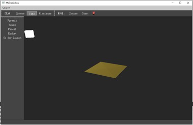

    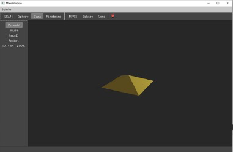

    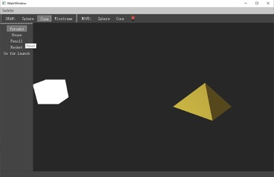

    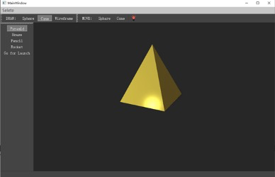

    

2. 将金字塔的底座拉伸成房子的形状

    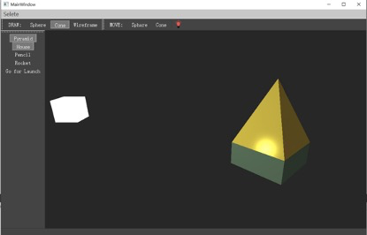

    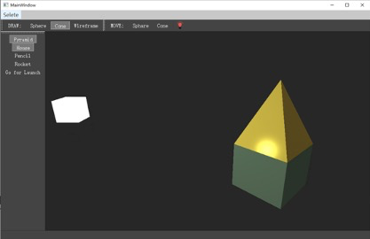

    

3. 继续拉伸下表面，增加椎体下部的顶点数量。经过这样的转变，它将呈现出铅笔的形状（火箭体）

    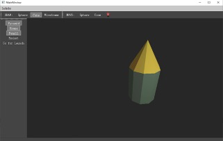

    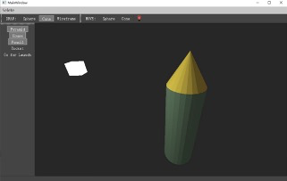

    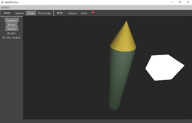

4. 最后，加入四个助推器，使其看起来像联盟号火箭

    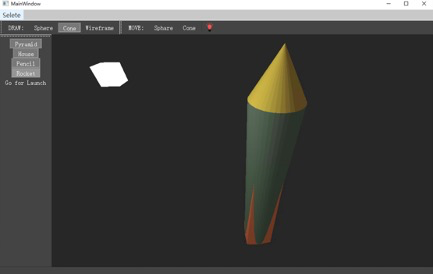

    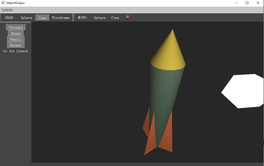

    

